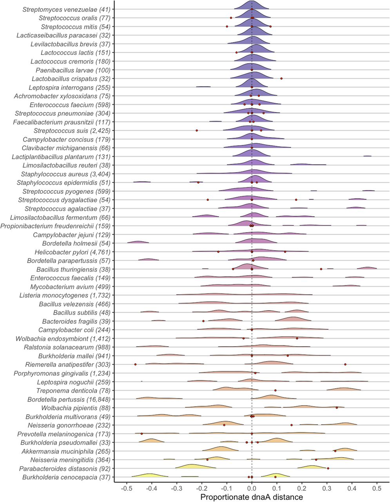

# Replication-associated inversions are the dominant form of bacterial chromosome structural variation

Prokaryotic rearrangements symmetric to the replication origin are identified across bacterial species with multiple complete genomes available in the Refseq database (n=247). Large-scale inversions are found to be highly prevalent across species, and their mediating factors are examined. The manuscript was published in [Life Science Alliance](https://www.life-science-alliance.org/content/6/1/e202201434), and the PDF can be downloaded [here](docs/RASR_publication.pdf). This repository contains the complete reproducible pipeline.

<strong>Abstract</strong>

The structural arrangements of bacterial chromosomes vary widely between closely related species and can result in significant phenotypic outcomes. The appearance of large-scale chromosomal inversions that are symmetric relative to markers for the origin of replication (OriC) has been previously observed; however, the overall prevalence of replication-associated structural rearrangements (RASRs) in bacteria and their causal mechanisms are currently unknown. Here we systematically identify the locations of RASRs in species with multiple complete sequenced genomes to investigate potential mediating biological mechanisms. We found that 247 out of 313 species contained sequences with at least one large (>50Kb) inversion in their sequence comparisons, and the aggregated inversion distances were normally distributed with a mean of zero.  Many inversions that were offset from dnaA were found to be centered on a different marker for the OriC. Instances of flanking repeats provide evidence that breaks formed during the replication process could be repaired to opposing positions. We also found a strong relationship between the later stages of replication and the range in distance variation from symmetry.

### RASRs are identified across bacterial phyla ###

  

### Structural variant distributions correspond with the Origin of replication ###

  
  

